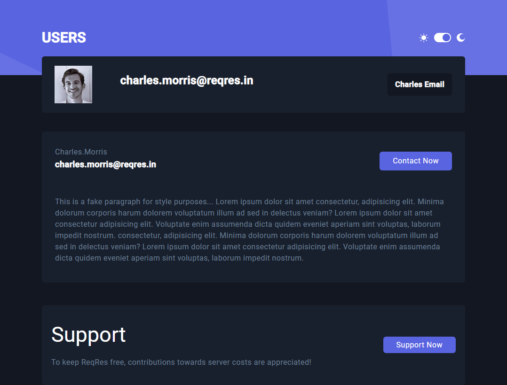

# Angular assessment Project

A Fake user dashboard app with Angular

### Links

- Live Site URL: https://angular-user-dashboard.vercel.app

### Description

Users should be able to:

- View the optimal layout for each of the website's pages depending on their
  device's screen size.
- View each page and be able to toggle between the tabs to see different
  information.
- Be able to filter users from the home page.
- Be able to search for a specific user.
- Be able to click a user from the home page so that they can read more
  information and apply for the user.

  ### Screenshot




### Tools

- HTML
- CSS & Tailwind CSS
- Angular 18

### Run The Development Server

```
 ng serve
```

or

```
 npm start
```
